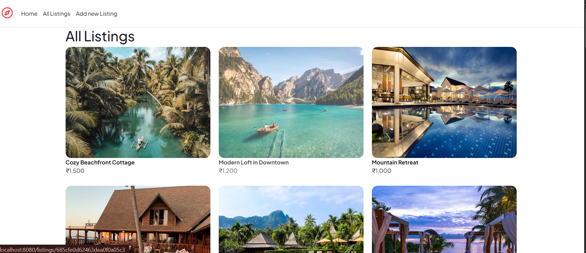
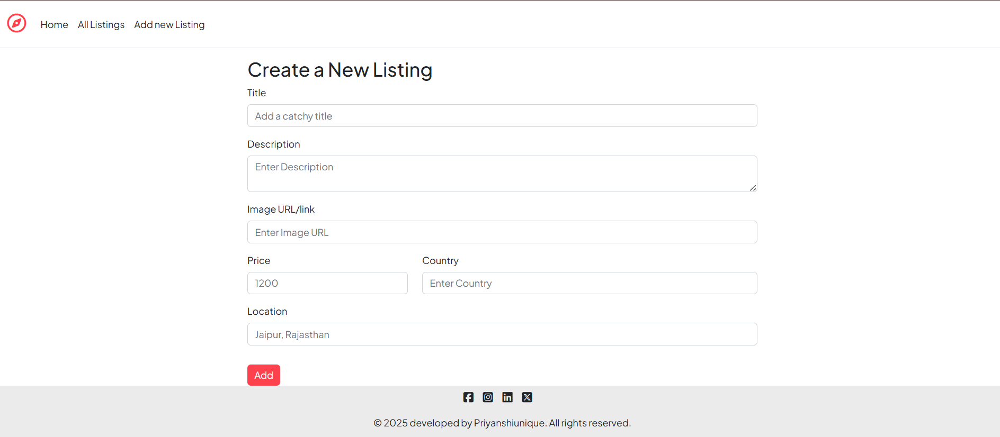
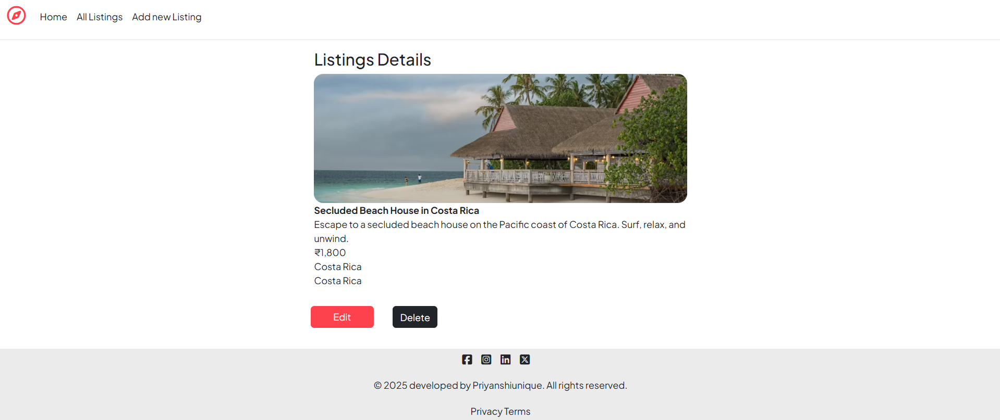

# 🏡 BookMyStay

A full-stack CRUD web application for managing property listings, built with Node.js, Express, MongoDB, and Mongoose. Features a modern UI, RESTful API routes, and dynamic styling for an engaging user experience.

## 🚀 Features

- **CRUD Operations:** Create, Read, Update, and Delete property listings.
- **RESTful API:** Well-structured routes for all listing operations.
- **Dynamic UI:** Responsive design with styled Index, New, Show, and Edit pages.
- **Reusable Components:** Modular Navbar and Footer for seamless navigation.
- **Database Integration:** MongoDB & Mongoose for robust data management.
- **Express Boilerplate:** Clean and scalable server setup.

## 📸 Screenshots

 

 

 

## 🛠️ Tech Stack

- **Frontend:** HTML, CSS, Bootstrap
- **Backend:** Node.js, Express.js
- **Database:** MongoDB, Mongoose
- **Templating:** EJS

## 🏗️ Project Structure

BookMyStay/
├── init/
│   ├── data.js
│   └── index.js
├── models/
│   └── Listing.js
├── public/
│   ├── css/
│   │   └── styles.css
│   ├── js/
│   │   └── script.js
├── utils/
│   ├── ExpressError.js
│   └── wrapAsync.js
├── views/
│   ├── listings/
│   │   ├── index.ejs
│   │   ├── new.ejs
│   │   ├── show.ejs
│   │   └── edit.ejs
│   ├── includes/
│   │   ├── navbar.ejs
│   │   └── footer.ejs
│   ├── layouts/
│   │   └── boilerplate.ejs
│   └── error.ejs
├── app.js
├── package.json
├── README.md
|└── schema.js
└── .gitignore   

## ✨ Getting Started

1. **Clone the repository:**
    - git clone https://github.com/Priyanshiunique/BookMyStay.git
    - cd Bookmystay

2. **Install dependencies:**
    - npm install

3. **Set up MongoDB:**
- Make sure MongoDB is running locally or update the connection string in `app.js`.

4. **Start the server:**
    - node app.js

5. The app will be running at [http://localhost:8080]

## 📚 Key Concepts Demonstrated

- Model-View-Controller (MVC) architecture
- RESTful routing
- CRUD operations with MongoDB/Mongoose
- Server-side rendering with EJS
- Modular and reusable UI components
- Responsive and modern CSS styling

